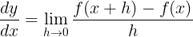
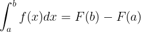
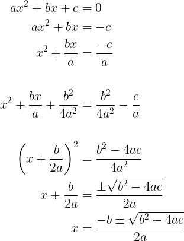

# Exercícios Auxiliares

---

> Veja as soluções em: [Soluções](./soluções.md)

## Seção: Escrevendo Documentos

### Exercício 1

1. Criar um documento do tipo article, com os pacotes fundamentais.
2. Criar uma seção chamada "Tipos e Tamanhos de Letras"
3. Criar duas subseções dentro dessa seção chamadas "Tipos" e "Tamanhos", respectivamente.
4. Dentro de cada uma recriar as listas dos slides 14 e 15

DICA: utilize `\textbackslash` para a contra-barra.

### Exercício 2

1. Reproduzir o seguinte exercício em LaTeX:
(Utilizando Formatação Matemática)

### Exercício 3

1. Escrever como encontrar as raízes, através da fórmula quadrática, partindo da forma geral, de uma equação do segundo grau.

### Exercício 4

1. Criar uma seção chamada "Definições Matemáticas"
2. Criar uma subseção chamada "Definição de Derivada" e escrevê-la
3. Criar uma subseção chamada "Definição de Integral" e escrevê-la

OBS: Formas gerais, aquela basicona lá.

### Exercício 5

1. Inserir uma Imagem abaixo de um texto explicando-a.

## Seção: Formatação Avançada

### Exercício 6

1. Inserir duas imagens lado a lado
2. Inserir uma única legenda

### Exercício 7

1. Desenvolver a forma geral até a fórmula quadrática usando align.

### Exercício 8

1. Criar uma tabela colorida com 3 colunas chamadas "Nome", "Idade" e "Parentesco"
2. Crie uma linha para cada pessoa que mora com você, incluindo você.
3. Crie bordas para todas as células
4. Centralize os textos de cada célula
5. Centralize a tabela na página
6. Deixe-a com .6 o tamanho do texto.

(OBS: Utilize o método que preferir)

---
